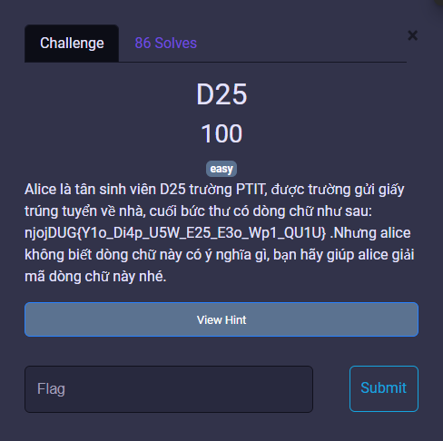

# MiniCTF 2025 - Writeup for Crypto challenge

## Challenge

## Solution

Quan sát phần ngoài `njojDUG`, ta dịch từng chữ cái lên 25 thì njojDUG -> miniCTF.

Áp cùng phép dịch cho phần trong {...}: 

`Y1o_Di4p_U5W_E25_E3o_Wp1_QU1U`  ->  `X1n_Ch4o_T5V_D25_D3n_Vo1_PT1T`

Vậy ta đã có flag.

## Flag

`miniCTF{X1n_Ch4o_T5V_D25_D3n_Vo1_PT1T}`