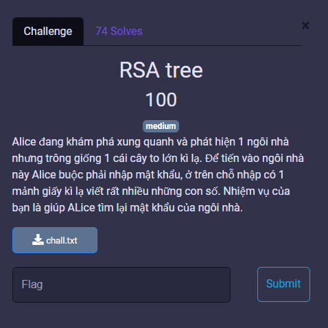
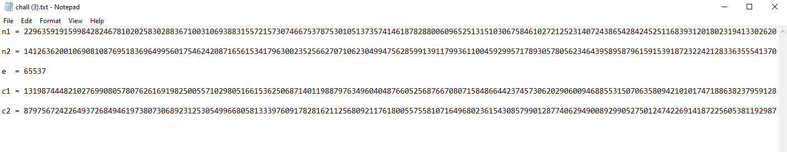
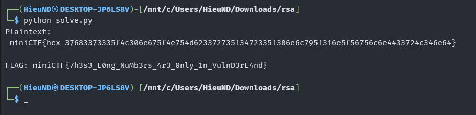

# MiniCTF 2025 - Writeup for Crypto challenge

## Challenge

## Solution

Trước tiên chúng ta tải file `chall.txt`, mở file đó, ta thấy 5 dòng dãy số cực lớn. 

Vì kích thước số quá lớn và là dạng toán mô-đun đặc thù của RSA, chúng ta cần chạy code để có thể giải mã 1 cách dê dàng.

Để giải mã được chúng ta cần chạy đoạn code python như sau: [solve.py](solve.py)

Để tạo file `solve.py` chúng ta mở VS Code và `Open Folder` thư mục chứa `chall.txt`. Sau đó thêm 1 file `solve.py`.

Như vậy chúng ta có file `solve.py`.

## Flag

`miniCTF{7h3s3_L0ng_NuMb3rs_4r3_0nly_1n_VulnD3rL4nd}`