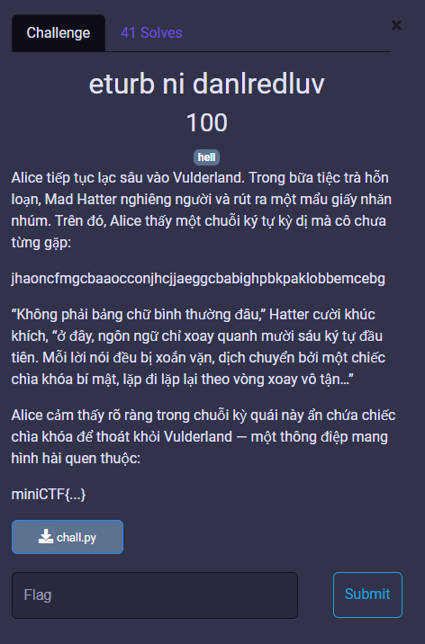
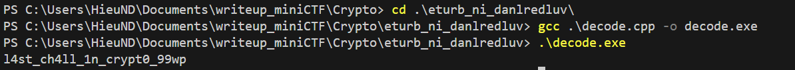

# MiniCTF 2025 - Writeup for Crypto challenge

## Challenge

## Solution

Trước tiên chúng ta tải file `chall.py`, mở file đó, ta sẽ thấy có chuỗi ciphertext: `jhaoncfmgcbaaocconjhcjjaeggcbabighpbkpaklobbemcebg`.

Đây là chuỗi b16 nhưng đã bị dịch Vigenere mod16 với key lặp lại.

Ta sẽ decode lại đoạn mã đó. Chạy [decode.cpp](decode.cpp), ta sẽ có được nội dung của flag.

Vậy chúng ta đã có flag của bài.

## Flag
`miniCTF{l4st_ch4ll_1n_crypt0_99wp}`