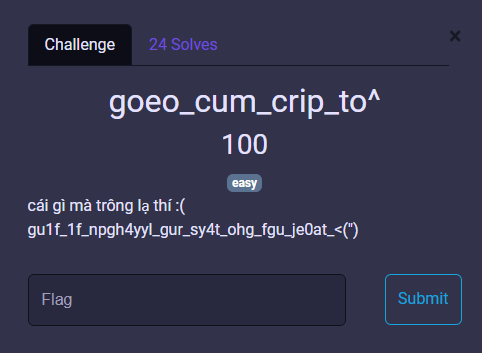

# MiniCTF 2025 - Writeup for Crypto challenge

## Challenge

## Solution

Bước đầu tiên, chúng ta nhận thấy các chữ cái trong chuỗi rất giống pattern của ROT13. Thử decode bằng ROT13:

`gu1f_1f_npgh4yyl_gur_sy4t_ohg_fgu_je0at_<(")` ->
`th1s_1s_actu4lly_the_fl4g_but_sth_wr0ng_<(")`

Thoạt nhìn tưởng đã xong, nhưng khi nộp thì hệ thống báo sai. Như vậy, đoạn ROT13 chỉ để đánh lạc hướng.

Ta thử quay lại, dùng chính ciphertext ban đầu làm flag. 

Chính xác rồi, vậy là ta đã tìm ra flag.

## Flag
`miniCTF{gu1f_1f_npgh4yyl_gur_sy4t_ohg_fgu_je0at_<(")}`