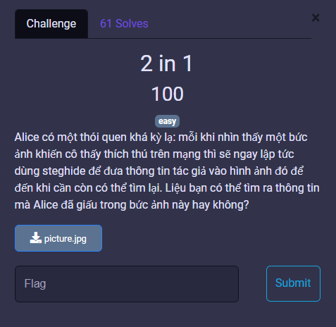
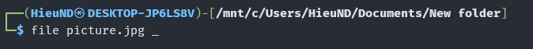
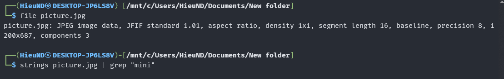
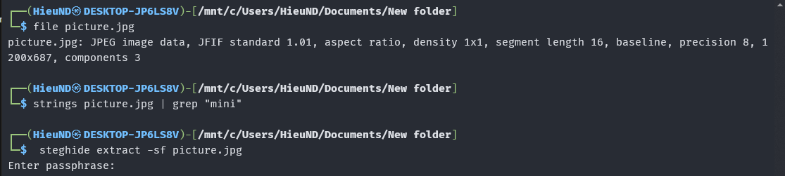
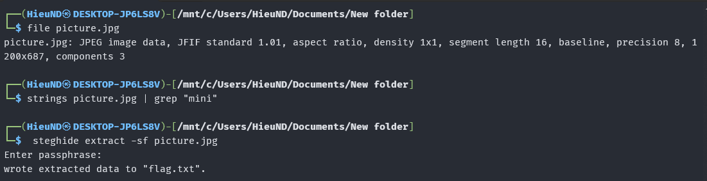
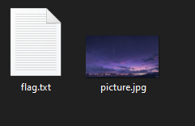

# MiniCTF 2025 - Writeup for Forensic challenge

## Challenge

## Solution

Nhìn vào bức hình này,thì việc ta nghĩ đến đầu tiên là dạng forensic qua hình ảnh.

Vậy chúng ta kiểm tra file qua Terminal nhé.

Đầu tiên ta dùng lệnh `file` để xác định định dạng thực sự của file `picture.jpg`.

Tiếp theo dùng lệnh `strings` để trích xuất tất cả các chuỗi có thể đọc được từ file nhị phân. Kết hợp với `grep "mini"` để lọc ra các chuỗi có chứa từ khóa "mini".

Sau đó, sử dụng công cụ `steghide` để giải nén dữ liệu ẩn bên trong ảnh.

- `extract`: chế độ giải nén.

- `-sf picture.jpg`: chỉ định ảnh làm “stego file” (file chứa dữ liệu ẩn).

Chương trình yêu cầu `passphrase`. Nếu dữ liệu giấu có mật khẩu, cần nhập đúng mới trích xuất được. Ở đây có thể không có pass hoặc pass trống, ta chỉ cần nhấp phím `enter`, `steghide `báo đã giải nén thành công và lưu dữ liệu ra file `flag.txt`.

Ta mở lại folder, ta thấy file `flag.txt`.

Vậy chúng ta đã có flag.

## Flag
`miniCTF{1UoY_15778566}`