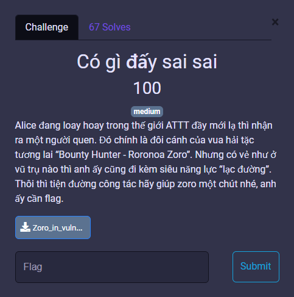
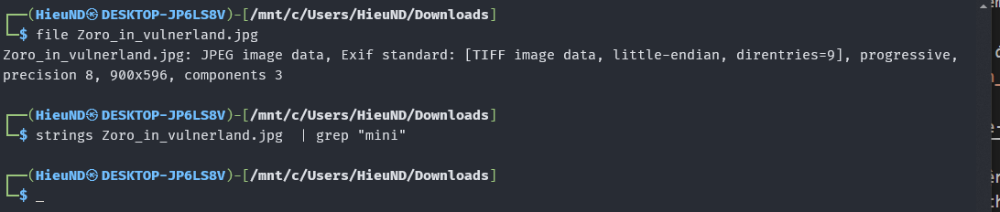
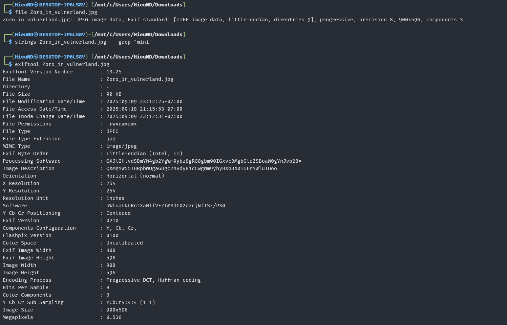
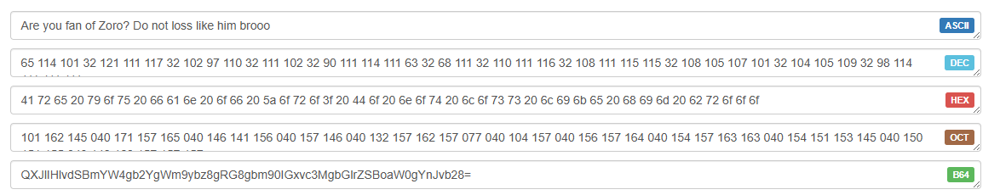
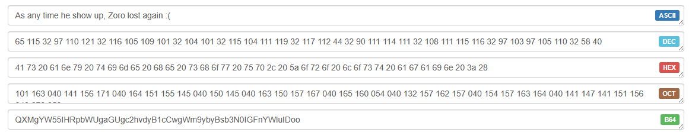
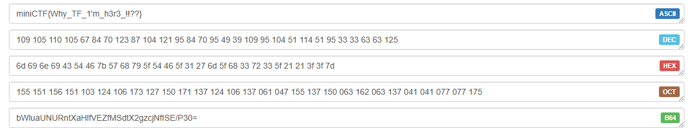

# MiniCTF 2025 - Writeup for Forensic challenge

## Challenge

## Solution

Trước tiên chúng ta tải file `Zoro_in_vulnerland.jpg`. Ta cùng kiểm tra file qua Terminal. 

Dùng lệnh `file` để xác định định dạng thực sự của
của file `Zoro_in_vulnerland.jpg`.

Tiếp theo dùng lệnh `strings` để trích xuất tất cả các chuỗi có thể đọc được từ file nhị phân. Kết hợp với `grep "mini"` để lọc ra các chuỗi có chứa từ khóa "mini".

Vậy là không có rồi. Chúng ta tiếp tục dùng lệnh `exiftool` để xem thông tin metadata của ảnh.

Ta có thể thấy 3 dòng metadata đáng chú ý.

`Processing Software: QXJlIHlvdSBmYW4gb2YgWm9ybz8gRG8gbm90IGxvc3MgbGlrZSBoaW0gYnJvb28=`

`Image Description: QXMgYW55IHRpbWUgaGUgc2hvdyB1cCwgWm9ybyBsb3N0IGFnYWluIDoo`

`Software: bWluaUNURntXaHlfVEZfMSdtX2gzcjNfISE/P30=`

Nhìn qua chúng ta thấy rằng đây là các chuỗi có dạng Base64. Cùng đi giải mã nào.

Dòng thứ 1 không phải.

Dòng thứ 2 cũng không phải.

Đến dòng thứ 3 chúng ta đã thu được flag.

## Flag
`miniCTF{Why_TF_1'm_h3r3_!!??}`