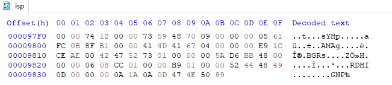
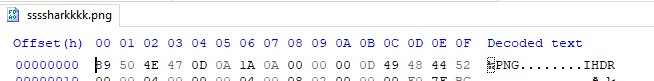
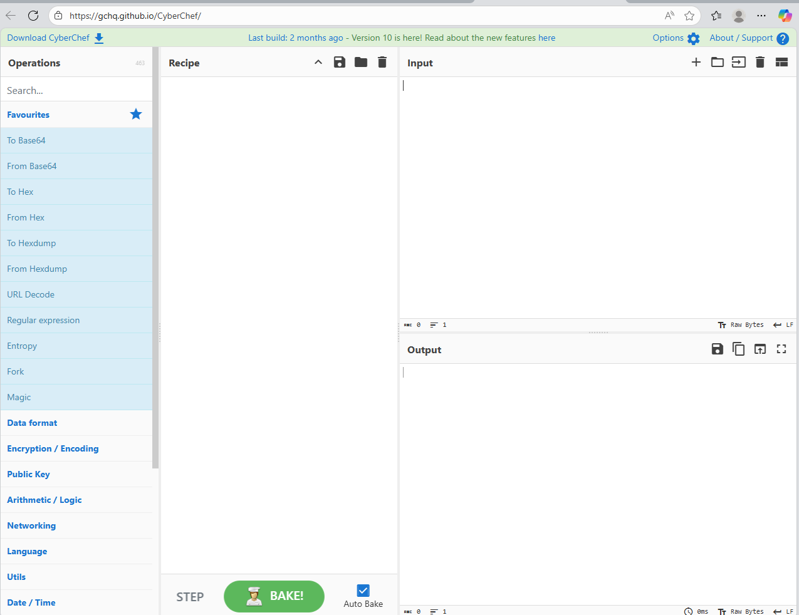
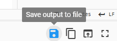
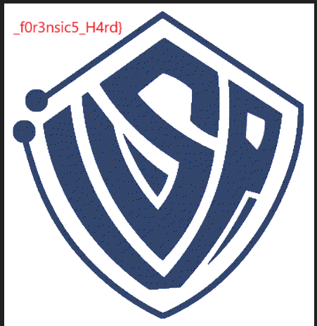
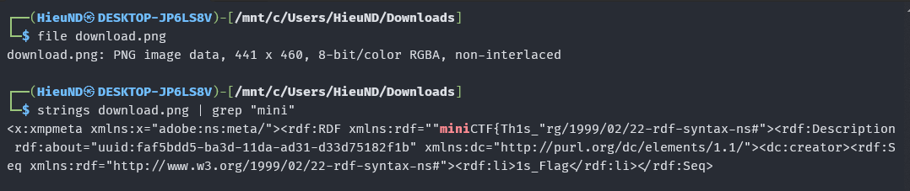

# MiniCTF 2025 - Writeup for Forensic challenge

## Challenge

## Solution

Trước tiên chúng ta tải file `isp` và kiểm tra file trong HxD.

Ta lướt xuống cuối ta thấy GNP%.

Ta biết rằng 1 file `.png` nó sẽ bắt đầu với những kí tự là %PNG. Ví dụ:

Như vậy ta nhận ra rằng chúng ta cần đảo ngược các ký tự của file `isp`.

Để đảo ngược được các kí tự, chúng ta cần sử dụng 1 trang web: [`CyberChef`](https://gchq.github.io/CyberChef/)

Ở phần `Operations`, ta tìm kiếm `Reverse` và kéo sang ô `Recipe`, sau đó đưa file `isp` vào ô `Input`.

(Lưu ý: By phải để là `Byte`, không được để `Line` hay `Character`)

Tiếp theo ta lưu file đã đảo ngược các ký tự dưới 1 file mới.

Vậy là chúng ta có 1 file ảnh mới.

Ta thấy được 1 phần của flag. Tiếp tục tìm các phần còn lại của flag. 

Mở file `download.png` trong Terminal. Dùng lệnh `file` để xác định định dạng thực sự của file `chall.jpg` và lệnh `strings` để trích xuất tất cả các chuỗi có thể đọc được từ file nhị phân. Kết hợp với `grep "mini"` để lọc ra các chuỗi có chứa từ khóa "mini".

Ta thấy được 2 phần flag:
- miniCTF{Th1s_
- 1s_Flag

Như vậy gộp các phần lại chúng ta đã có được flag.

## Flag

`miniCTF{Th1s_1s_Flag_f0r3nsic5_H4rd}`