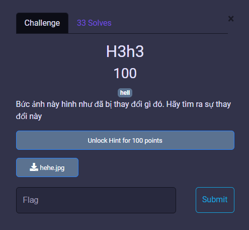
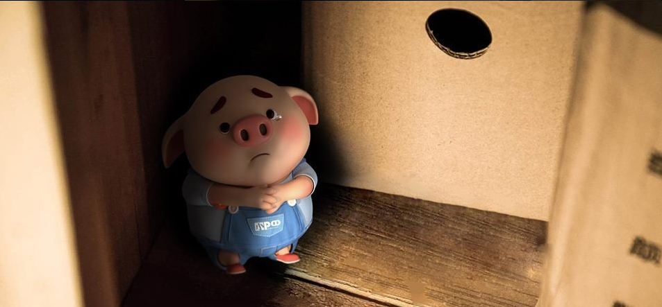
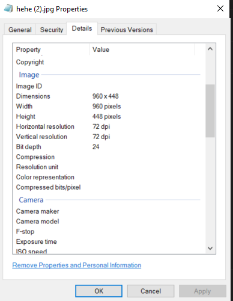
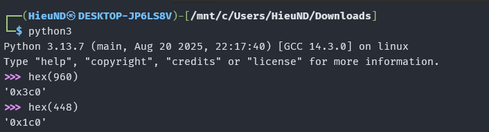
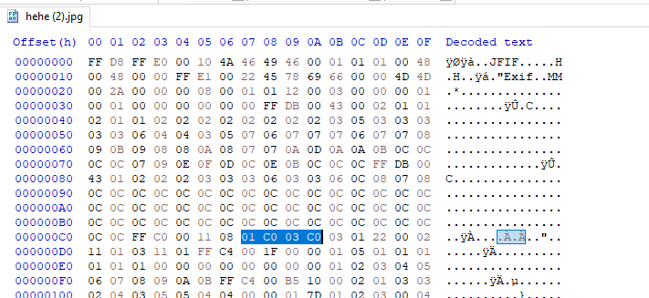
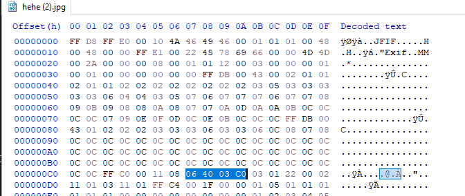
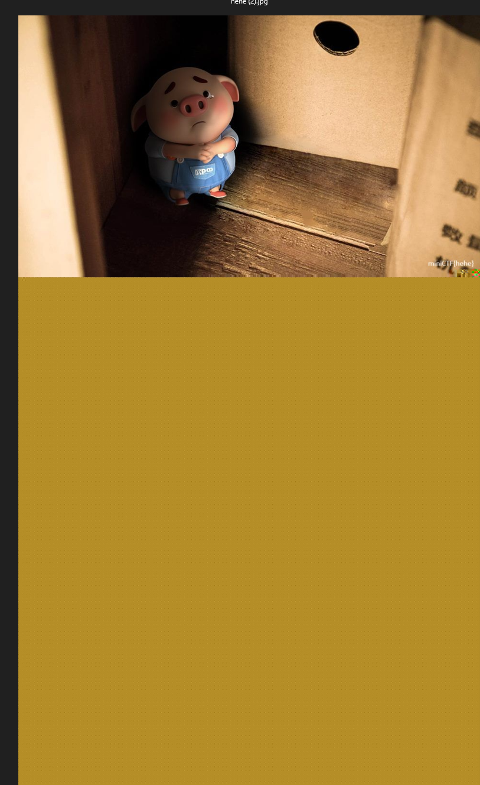

# MiniCTF 2025 - Writeup for Forensic challenge

## Challenge

## Solution

Trước tiên chúng ta tải file `hehe.jpg` và mở file.

Chúng ta kiểm tra thông tin của ảnh.

Ta nhận thấy rằng kích thước của file ảnh này khá nhỏ. Như vậy nhiệm vụ của chúng ta là điều chỉnh kích thước cảu file ảnh để có thể thu nhỏ ảnh lại.

Ta kiểm tra `hex(960)` và `hex(448)`.

Là `03 C0` và `01 C0`. Đưa file ảnh vào HxD, ta tìm `03 C0` và `01 C0` vì đó là kích thước của file ảnh. Sau đó chỉnh sửa sao cho phù hợp.

Ta chỉnh lên 1 kích thước thật lớn, sau đó kiểm tra lại ảnh.

Như vậy chúng ta đã có được flag (ở góc nhỏ bên phải của ảnh).

## Flag

`miniCTF{hehe}`