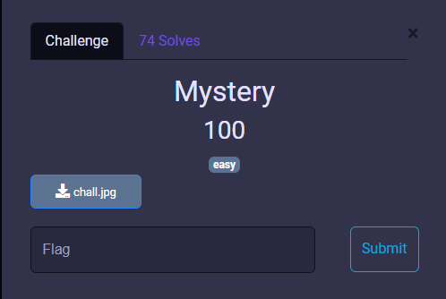
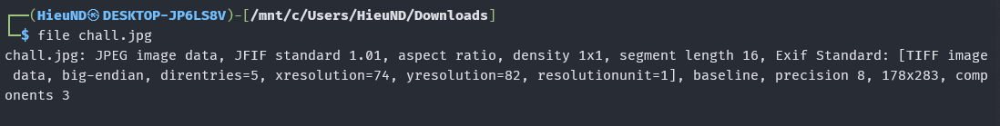
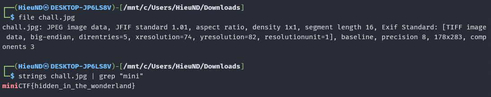

# MiniCTF 2025 - Writeup for Forensic challenge

## Challenge

## Solution

Trước tiên chúng ta tải file `chall.jpg`. Ta cùng kiểm tra file qua Terminal.

Dùng lệnh `file` để xác định định dạng thực sự của file `chall.jpg`.

Tiếp theo dùng lệnh `strings` để trích xuất tất cả các chuỗi có thể đọc được từ file nhị phân. Kết hợp với `grep "mini"` để lọc ra các chuỗi có chứa từ khóa "mini".

Vậy là chúng ta đã tìm ra flag

## Flag
`miniCTF{hidden_in_the_wonderland}`