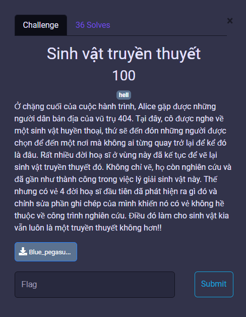
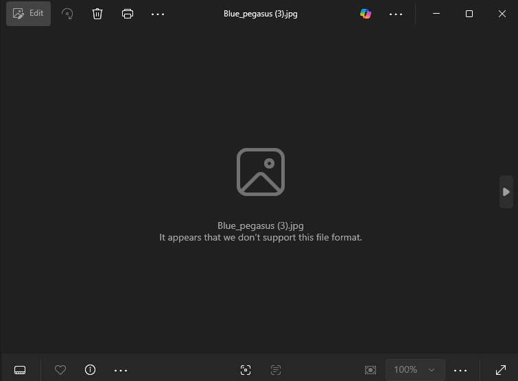
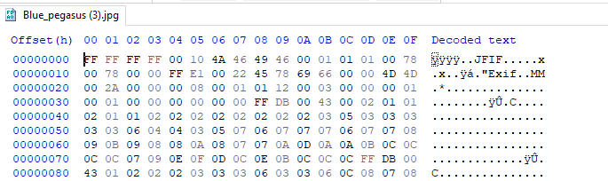
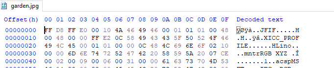
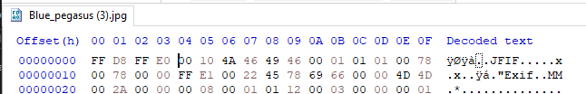
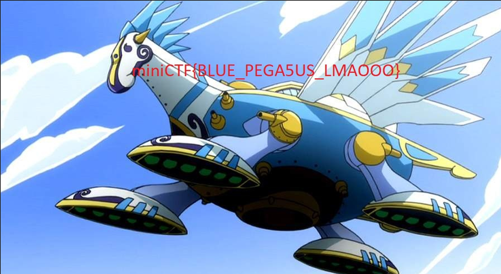

# MiniCTF 2025 - Writeup for Forensic challenge

## Challenge

## Solution

Trước tiên chúng ta tải file `Blue_pegasus.jpg` và mở ảnh.

Không có gì. Vậy có lẽ metadata của file có gì đó bị sai. Chúng ta cùng check file trong HxD nào.

Đây có vẻ không phải kí tự của file `.jpg`. Ví dụ 1 file `.jpg`: 

Vậy 4 kí tự đầu phải là `FF D8 FF E0`. Ta sửa lại trong file đề bài yêu cầu và save lại nó.

Sau đó sẽ có 1 file ảnh mới. Mở ảnh và chúng ta thu được flag.

## Flag

`miniCTF{BLUE_PEGA5US_LMAOOO}`