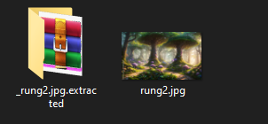

# MiniCTF 2025 - Writeup for Forensic challenge

## Challenge

## Solution

Trước tiên chúng ta tải file `rung1.jpg`. Ta cùng kiểm tra file qua Terminal.

Dùng lệnh `file` để xác định định dạng thực sự của file `chall.jpg`.

Tiếp theo dùng lệnh `strings` để trích xuất tất cả các chuỗi có thể đọc được từ file nhị phân. Kết hợp với `grep "mini"` để lọc ra các chuỗi có chứa từ khóa "mini".

Vậy là không có rồi. Chúng ta tiếp tục dùng lệnh `exiftool` để xem thông tin metadata của ảnh.

Không có gì cả. Chúng ta tiếp tục dùng lệnh `binwalk -e` để quét file và tự động giải nén.

Vậy là chúng ta đã có 1 file extracted.

Mở file đó ta thấy 1 file zip. Ta sẽ giải nén file zip đó và mở file đã được giải nén, ta lại thấy 1 bức ảnh khác.

Ta tiếp tục kiểm tra file ảnh qua Terminal và làm tương tự như các bước như trên.

Sau khi `binwalk` ta lại có 1 file extracted.

Giải nén nó ta lại có bức ảnh thứ 3.

Ta lại tiếp tục kiểm tra file ảnh qua Terminal và tiếp tục làm tương tự như trên.

Tiếp tục giải nén. Đến lần này chúng ta cần nhập password mới có thể giải nén được. 

Bây giờ chúng ta sẽ cần đi tìm password. Hãy mở trong Terminal và dùng lệnh `rar2john`. `rar2john` sẽ chuyển file RAR thành hash để có thể crack pass.

Sử dụng lệnh `ls /usr/share/wordlists/` và `john --wordlist=/usr/share/wordlists/rockyou.txt ok.hash`

Như vậy password của chúng ta là: 123456.

## Flag
`miniCTF{I_L0v3_ISPCLUB}`