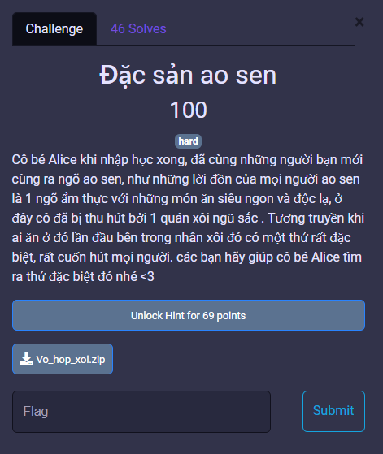
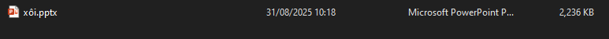
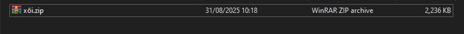
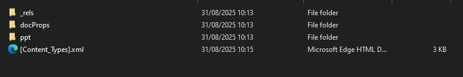
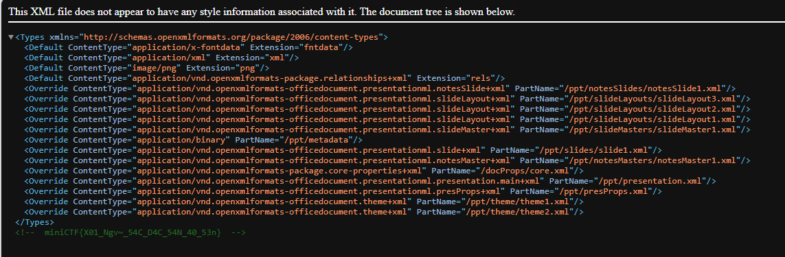

# MiniCTF 2025 - Writeup for Forensic challenge

## Challenge

## Solution

Trước tiên chúng ta tải file `Vo_hop_xoi.zip`, sau đó ta extract file zip rồi mở file đó, ta sẽ thấy 1 file PowerPoint (đuôi `.pptx`).

File PowerPoint thực chất là một dạng Open XML format, có thể mở được như file .zip.

Đổi tên `xôi.pptx` -> `xôi.zip`.

Sau đó extract file zip đó, ta sẽ thấy cấu trúc thư mục của PowerPoint, bao gồm nhiều thư mục con:

Kiểm tra từng file.

Khi đến file `[Content_Types].xml`, ta sẽ thấy flag.

## Flag
`miniCTF{X01_Ngv~_54C_D4C_54N_40_53n}`