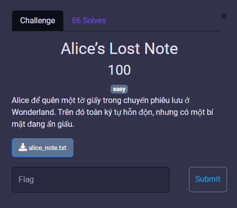
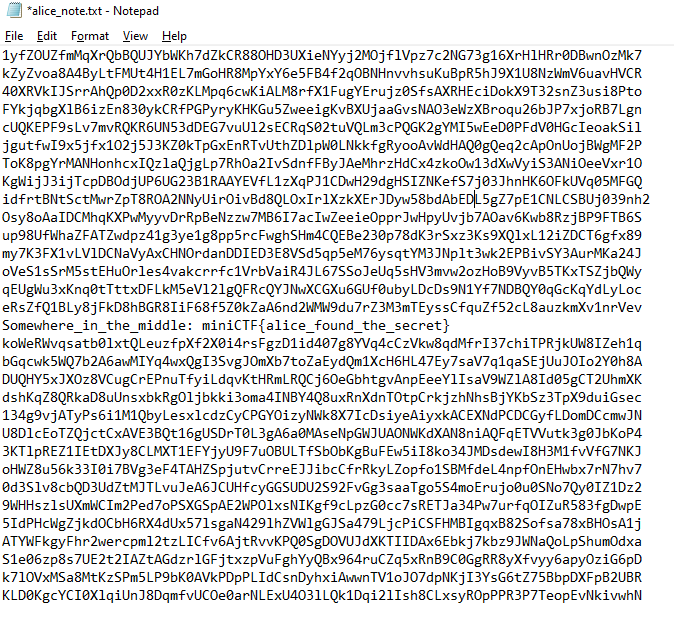

# MiniCTF 2025 - Writeup for Miscellaneous challenge

## Challenge

## Solution

Trước tiên chúng ta tải file `alice_note.txt` và mở file.

Nhìn qua ta chỉ thấy phần lớn chỉ là những chuỗi mã hóa ngẫu nhiên. Tuy nhiên ở giữa file, có 1 đoạn rất rõ ràng.

`Somewhere_in_the_middle: miniCTF{alice_found_the_secret}`.

Và đó là flag của chúng ta.

## Flag
`miniCTF{alice_found_the_secret}`