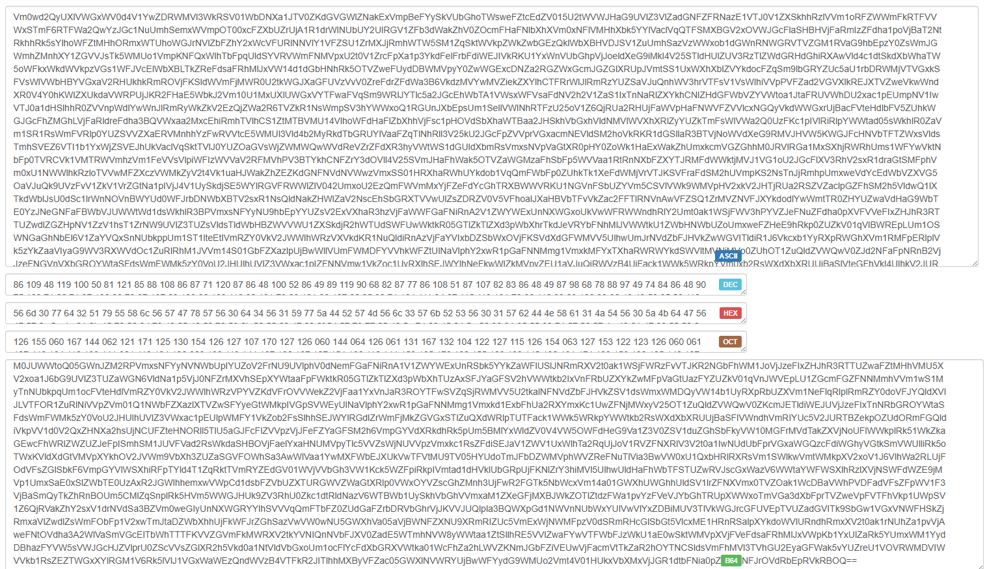
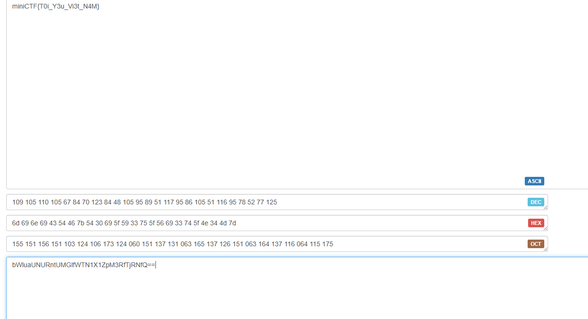

# MiniCTF 2025 - Writeup for Web challenge

## Challenge

## Solution

Trước tiên chúng ta tải file `CON_GI_EP_HON_Nhac_phim_Mua_o_-_Nguyen_Hung_Lyric_Video.mp3`. Chỉ là 1 video nhạc, chúng ta kiểm tra file trong HxD.

Lướt xuống dưới cùng, chúng ta thấy 1 đoạn mã Base64 dài.

Ta decode đoạn mã đó.

Ta thấy ở phần `ASCII` tiếp tục có đoạn mã Base64, tiếp tục decode.

Tiếp tục làm như vậy nhiều lần, cuối cùng chúng ta sẽ thu được flag.

## Flag

`miniCTF{T0i_Y3u_Vi3t_N4M}`