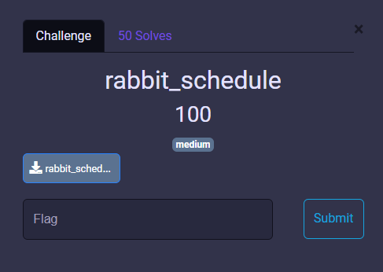
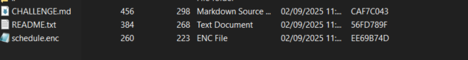
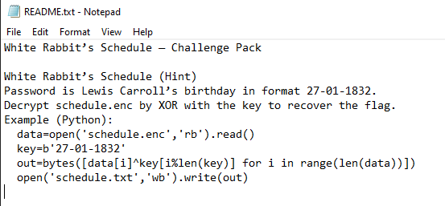
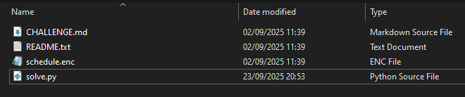
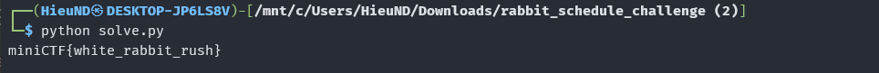

# MiniCTF 2025 - Writeup for Web challenge

## Challenge

## Solution

Trước tiên chúng ta tải file `rabbit_schedule_challenge.zip` và extract file.

Chúng ta được cung cấp tệp mã hóa `schedule.enc` và gợi ý trong `README.txt`. Nhiệm vụ là giải mã tệp để thu được nội dung lịch và trích xuất flag.

**Xem gợi ý trong README:** 

Bản mã được tạo bằng cách XOR từng byte dữ liệu với chuỗi khóa lặp lại. Khi giải mã, ta lặp khóa theo độ dài tệp và XOR lại lần nữa (vì XOR tự đảo).

Chúng ta cùng giải mã nào. Tạo file `solve.py` cạnh `schedule.enc`.

Để tạo file `solve.py` chúng ta mở VS Code và `Open Folder` thư mục chứa `schedule.enc`. Sau đó thêm 1 file `solve.py` với nội dung như sau: [solve.py](solve.py).

Vậy là chúng ta có file `solve.py`.

Tiếp theo chúng ta chạy file `solve.py` trong Terminal.

Như vậy chúng ta đã có flag.

## Flag
`miniCTF{white_rabbit_rush}`