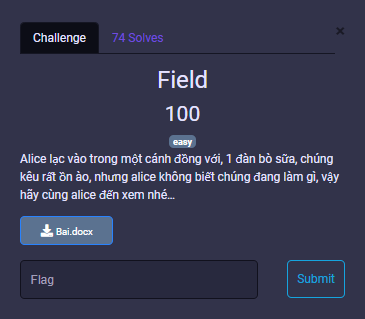

# MiniCTF 2025 - Writeup for Reverse Engineering challenge

## Challenge

## Solution

Trước tiên chúng ta tải file `Bai.docx`.

Sau khi tải file source về, ta thấy chương trình có khai báo một mảng a[] và lần lượt gán giá trị ký tự vào các vị trí có chỉ số khác nhau, ví dụ:
- a[1] := 'm';
- a[2] := 'i';
- a[3] := 'n';
- ....

Nhìn sơ qua, ta nhận ra các ký tự này trông giống một chuỗi `miniCTF{`.

Bây giờ ta cần sắp xếp mảng theo chỉ số tăng dần, sau đó ghép lại chuỗi.

Ta sẽ chạy [solve.cpp](solve.cpp), ta sẽ có chuỗi:

 miniCTF{Th3_C0vv_15_Gr4z1ng_1n_Th3_F13ld}!@#$%^&*(É╗=+[]{};:e",.>?|\`~1234567890ab☻defghijklmnopqr

Vậy ta đã có flag.

## Flag
`miniCTF{Th3_C0vv_15_Gr4z1ng_1n_Th3_F13ld}`

(Phần sau chỉ là các ký tự ASCII bổ sung, không nằm trong flag).