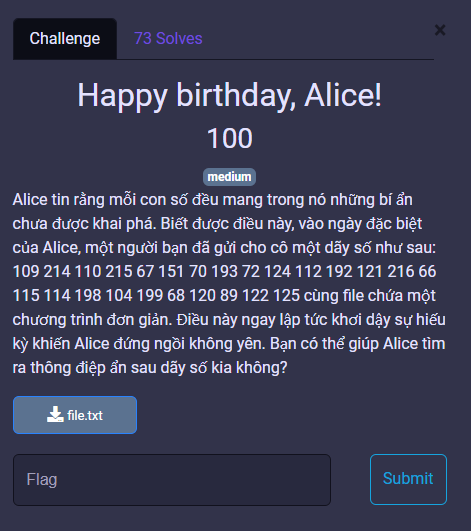
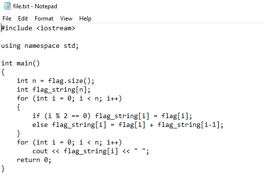
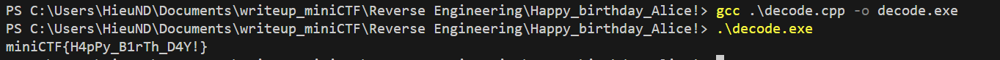

# MiniCTF 2025 - Writeup for Reverse Engineering challenge

## Challenge

## Solution

Đọc qua đề bài chúng ta thấy có 1 dãy số: `109 214 110 215 67 151 70 193 72 124 112 192 121 216 66 115 114 198 104 199 68 120 89 122 125`. Vậy chúng ta cần tìm flag qua chuỗi này.

Tải `file.txt`, ta thấy 1 đoạn code C++.

Chương trình có một chuỗi flag. Nó duyệt từng ký tự của flag và lưu vào mảng `flag_string`.

- Nếu chỉ số chẵn:

`flag_string[i] = flag[i];`

(tức là giữ nguyên giá trị ASCII của ký tự)

- Nếu chỉ số lẻ:

`flag_string[i] = flag[i] + flag_string[i-1];`

(tức là cộng giá trị ASCII của ký tự với phần tử trước đó)

Cuối cùng, chương trình in mảng `flag_string` ra ngoài.

Ta chạy [decode.cpp](decode.cpp) để tìm ra flag.

## Flag
`miniCTF{H4pPy_B1rTh_D4Y!}`