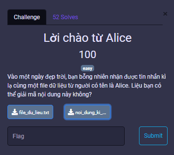
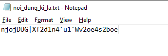
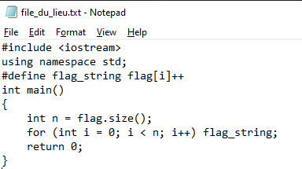
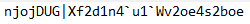

# MiniCTF 2025 - Writeup for Reverse Engineering challenge

## Challenge

## Solution

Trước tiên chúng ta tải file `file_du_lieu.txt` và `noi_dung_ki_la.txt`, mở 2 file đó.

Đây là file `noi_dung_ki_la.txt`.

Đây là file `file_du_lieu.txt`.

Ở file `noi_dung_ki_la.txt` ta có một chuỗi bị mã hoá:  

Ở file file_du_lieu.txt, `#define flag_string flag[i]++` cho thấy:

- Chương trình sẽ duyệt qua từng ký tự trong biến flag.

- Với mỗi ký tự, nó thực hiện `flag[i]++` tức tăng giá trị ASCII thêm 1.

Ta giải mã [decode.cpp](decode.cpp) và có được flag

## Flag
`miniCTF{We1c0m3_t0_Vn1d3c1r1on}`