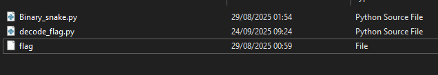

# MiniCTF 2025 - Writeup for Reverse Engineering challenge

## Challenge

## Solution

Trước tiên chúng ta tải file `file_for_upload_rename_to_Ran_nhi_phan.zip` và extract file.

Bài cho ta một script Python có tên `Binary_snake.py`. 

Khi dò mã, ta thấy đoạn chính: Với mỗi ký tự của nội dung `flag`, chương trình XOR với ký tự tương ứng của khóa rồi in ra ngay.  

Giải mã các ký tự nào. Đầu tiên chúng ta cần tạo 1 file `decode_flag.py`.
Để tạo file `decode_flag.py` chúng ta mở VS Code và `Open Folder` thư mục chứa `flag`. Sau đó thêm 1 file `decode_flag.py` với nội dung như sau: [decode_flag.py](decode_flag.py).

Vậy là chúng ta có file `decode_flag.py`.

Tiếp theo chúng ta chạy file `decode_flag.py` trong Terminal.

Vậy chúng ta đã có flag.

## Flag

`miniCTF{W3ird_sn4k3_6366}`