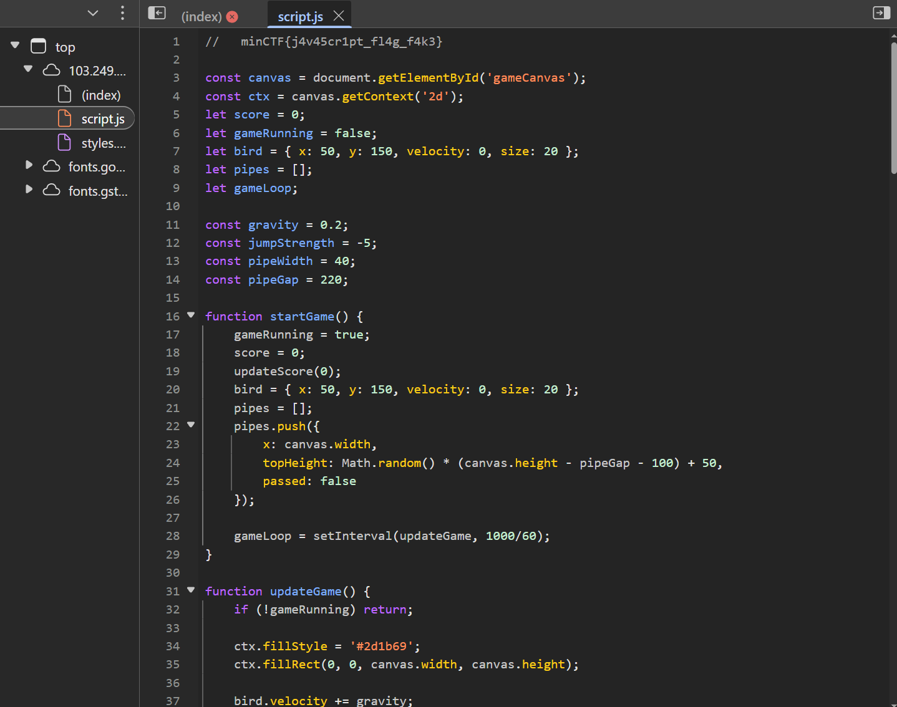

# MiniCTF 2025 - Writeup for Web challenge

## Challenge

## Solution

Đây sẽ là giao diện khi chúng ta vào link.

 

10000000000 điểm? Chơi đến bao giờ mới được?

Chúng ta thử check source code xem sao.

Ta thấy có 1 flag, nhưng có vẻ đó là fake flag. Ta tiếp tục check trong `script.js`

Ta lại thấy có 1 flag, nhưng đó cũng chỉ là fake flag. Ta đọc qua có thể thấy hàm `updateScore(n)` được gọi trong `startGame()` bằng `updateScore(0)`.

Ý tưởng: nếu trang tin tưởng giá trị từ Console, ta có thể tự gọi updateScore() với số điểm rất lớn để kích hoạt trả flag từ server.

Chuyển sang tab Console. Từ `script.js`, copy đúng tên hàm được gọi khi khởi tạo: `updateScore(0)`. 

Thay tham số bằng một số thật lớn để vượt mốc nhận flag.

Vậy ta đã có flag thật sự.

## Flag
`miniCTF{d0wn_th3_r4bb1t_h0l3_w3_g0}`