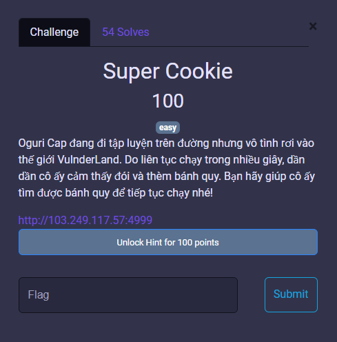
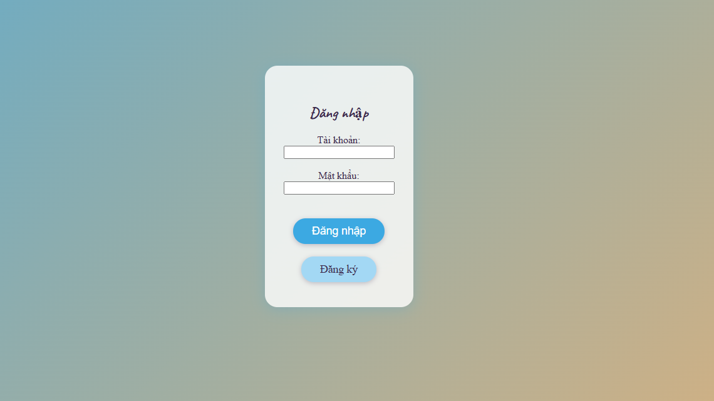
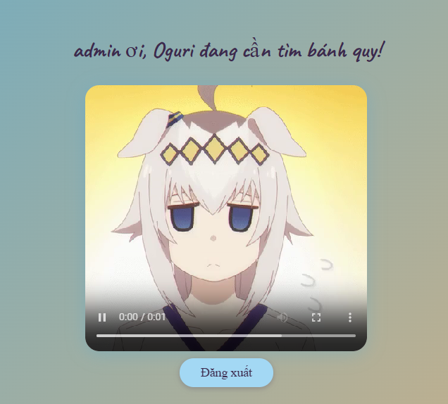
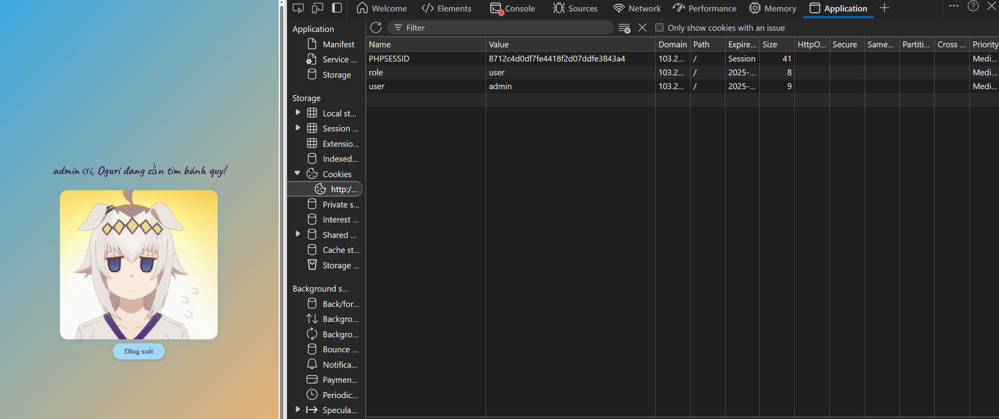
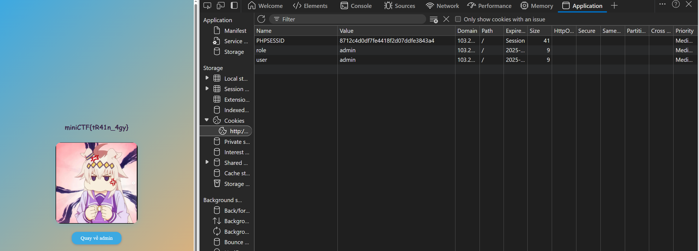
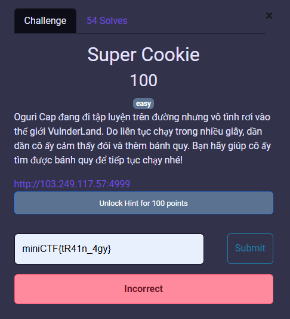
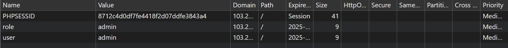
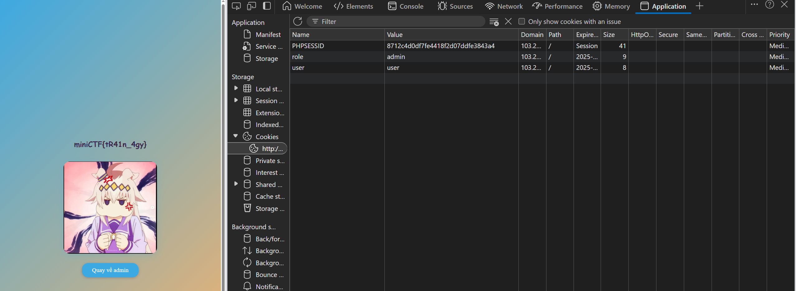
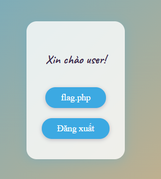
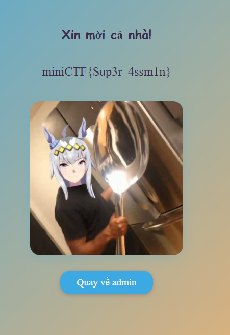

# MiniCTF 2025 - Writeup for Web challenge

## Challenge

## Solution

Đây sẽ là giao diện khi chúng ta vào link.

Trước tiên, ta hãy kiểm tra chức năng của trang web. Chúng ta sẽ đăng kí 1 tài khoản, sau đó đăng nhập bằng tài khoản đó, màn hình sẽ hiện như sau.

!

Chúng ta có thể đoán được flag có liên quan tới password và password này lại liên quan đến cookie của trang web? Vậy hãy kiểm tra cookie nào.

Chúng ta có thể thấy vai trò của chúng ta đang là `user`, chúng ta thử sửa `user` thành `admin` và sau đó reload lại trang.

Oh, chúng ta đã có flag, nộp bài thôi.

Ôi không, incorrect. 

Vậy đó chỉ là flag fake. Chúng ta hãy kiểm tra lại lần nữa. Nhìn qua các cookie, có thể thấy `user` = `admin`, điều này có vẻ đáng ngờ.

Chúng ta thử đổi giá trị `user` từ `admin` thành `user`, sau đó reload lại trang web.

Hmm, không có gì cả. Thử quay về admin xem sao.

Giao diện đã khác lúc trước. Nhấp vào flag.php. 

Wow, vậy là chúng ta đã tìm được flag thật sự.

- Điều này cho thấy ứng dụng đang kiểm tra giá trị của trường `user` theo cách nào đó và chỉ trả flag nếu vai trò của `user` chính là `user`. Có thể là một "bẫy" logic từ phía server.

- Kết luận:

Mặc dù `role` = `admin`, việc `user` = `admin` lại không được chấp nhận để nhận flag.

Bằng cách sửa cookie `user` từ `admin` thành `user`, người chơi có thể vượt qua kiểm tra và nhận được flag.

## Flag
`miniCTF{Sup3r_4ssm1n}`