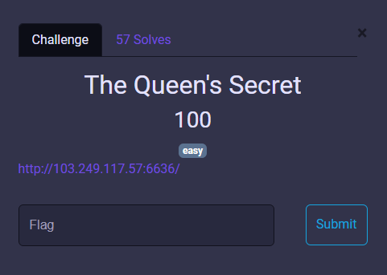
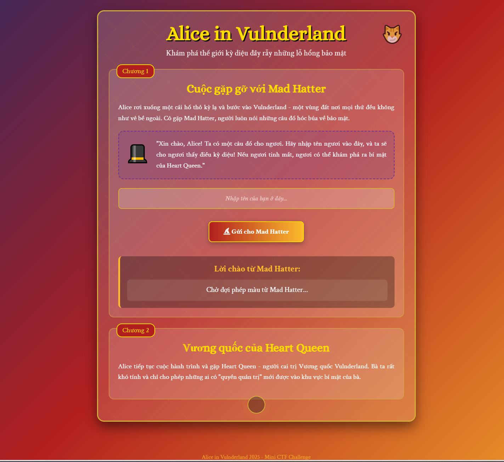
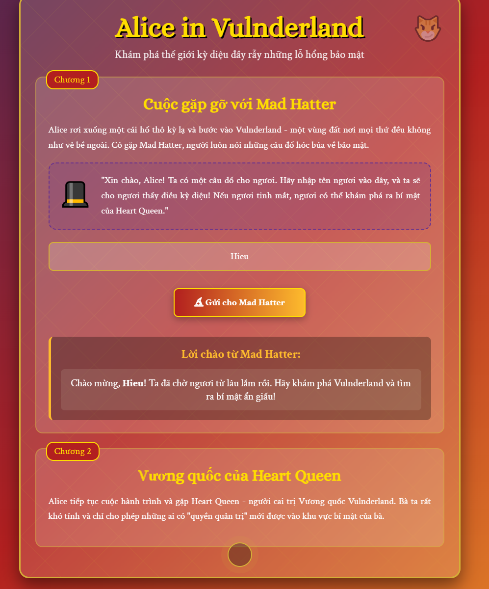
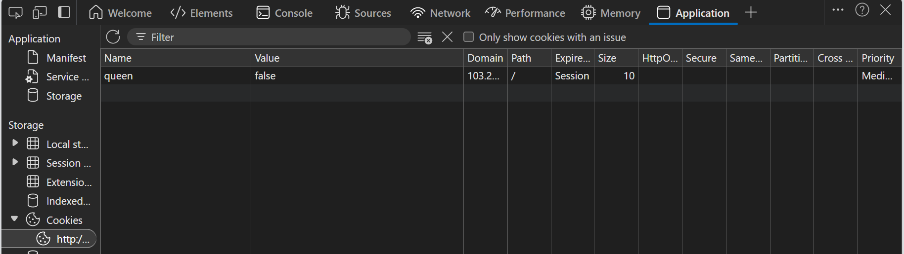
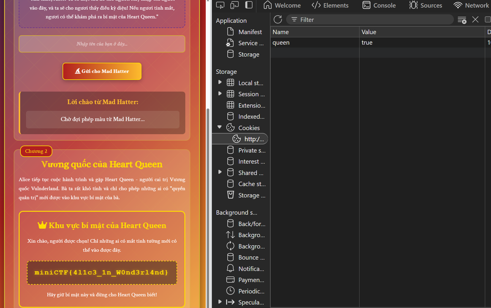

# MiniCTF 2025 - Writeup for Web challenge

## Challenge

## Solution

Đây sẽ là giao diện khi chúng ta vào link.

Chúng ta cần test chức năng của trang web. Đọc qua nội dung của chương 1. Nhập tên của bạn vào ô nhập tên.

Không có gì cả. Tiếp tục đọc nội dung chương 2.

`Bà ta rất khó tính và chỉ cho phép những ai có "quyền quản trị" mới được vào khu vực bí mật của bà.`

Chúng ta thấy rằng không có cách nào để trực tiếp tiếp cận khu vực bí mật. Vậy ta thử mở cookie lên kiểm tra nhé.

Tại đây xuất hiện một cookie tên là `queen` với giá trị ban đầu là `false`. Điều này cho thấy ứng dụng có thể đang dùng cookie này để phân quyền. Chúng ta thử thay đổi giá trị `false` thành `true`, sau đó reload lại trang web.

Vậy là chúng ta đã tìm được flag.

## Flag
`miniCTF{4l1c3_1n_W0nd3rl4nd}`